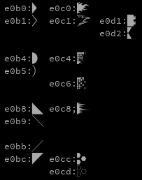

**There is [an English README](README.md).**  
# Prowpt - シンプルで軽量、カスタマイズ可能な Bash、Zsh 用 Powerline 風プロンプトテーマ  


  
作者は日本人にも関わらず、英語版のREADMEから書き始めてしまい、それを翻訳したものなので、不自然な日本語があるかと思います。ご了承ください。（一応不自然なところは直したつもりです。）  
## スクリーンショット  
  
注：シンタックスハイライトは付属しません。  
## 目次  
- [Prowpt - シンプルで軽量、カスタマイズ可能な Bash、Zsh 用 Powerline 風プロンプトテーマ](#prowpt---シンプルで軽量カスタマイズ可能な-bashzsh-用-powerline-風プロンプトテーマ)
  - [スクリーンショット](#スクリーンショット)
  - [目次](#目次)
  - [特徴](#特徴)
  - [必須条件](#必須条件)
  - [見た目](#見た目)
    - [Git ステータスアイコン](#git-ステータスアイコン)
  - [インストール方法](#インストール方法)
    - [Bash](#bash)
    - [Manual](#manual)
      - [Sheldon](#sheldon)
    - [Zsh](#zsh)
      - [Manual](#manual-1)
      - [Oh-My-Zsh](#oh-my-zsh)
      - [Zinit](#zinit)
      - [Antigen](#antigen)
      - [Zplug](#zplug)
      - [Sheldon](#sheldon-1)
  - [カスタマイズ](#カスタマイズ)
    - [カスタマイズ可能な値](#カスタマイズ可能な値)
      - [文字列](#文字列)
      - [区切り文字](#区切り文字)
      - [ホームディレクトリ（~）をハイライトするかどうか](#ホームディレクトリをハイライトするかどうか)
      - [プロンプトの色](#プロンプトの色)
      - [Git セグメント](#git-セグメント)
    - [その他のカスタマイズ](#その他のカスタマイズ)
  - [Contributing](#contributing)
  - [お問い合わせ](#お問い合わせ)
    - [連絡先](#連絡先)
  - [ライセンス](#ライセンス)

## 特徴  
- Zinit や Oh-My-Zsh などの一般的なプラグインマネージャで簡単にプラグインを管理できる  
- Git ブランチの状態によって表示や色が変わる  
- Python の virtualenv 環境が表示される
- コードが単純なため、カスタマイズが容易  
- カスタマイズ可能な変数が多い  
- リポジトリが軽量  

## 必須条件  
- Bash または Zsh  
Fish Shellでは動作しません。  
- Gitコマンド  
- [Nerd Fonts](https://www.nerdfonts.com)  
グリフを表示するために Nerd Fonts が必要です。  
- 256色表示可能な端末エミュレータ  

## 見た目  
  
Python の virtualenv 環境内にいる場合、最初のセグメントに表示されます。  
### Git ステータスアイコン 
- ステージされていないファイルがある場合: `*`  
- ステージングされたファイル: `+`  
- 退避（stash）されたファイル: `$`  
- 未追跡ファイル: `%`  

HEAD とアップストリームとの差  
- アップストリームが先行: `<`  
- HEADが先行: `>`  
- 分岐している: ``<>``  
- up-to-date: `=`  

## インストール方法  
### Bash  
### Manual  
1. リポジトリをクローンする  
    ```bash
    git clone https://github.com/alpaca-honke/prowpt.git  ~/.prowpt/
    ```
1. 以下の行を `~/.bashrc` の `PS1` 設定の下に追加  
    ```bash:.bashrc
    source ~/.prowpt/prowpt.bash
    ```
1. ターミナルを再起動  

#### Sheldon  
1. 次のコマンドを実行  
    ```bash
    sheldon add prowpt --github alpaca-honke/prowpt --use '*.bash' --branch main
    ```
1. ターミナルを再起動  

### Zsh  
#### Manual  
1. リポジトリをクローンする  
    ```zsh
    git clone https://github.com/alpaca-honke/prowpt.git ~/.prowpt/
    ```
1. `~/.zshrc` の以下の行をコメントアウト  
    ```zsh:.zshrc
    autoload -Uz promptinit
    promptinit
    prompt adam1
    ```
1. `~/.zshrc` に以下の行を追加  
    ```zsh:.zshrc
    source ~/.prowpt/prowpt.plugin.zsh
    ```
1. ターミナルを再起動  

#### Oh-My-Zsh  
1. リポジトリをクローンする  
    ```zsh
    git clone https://github.com/alpaca-honke/prowpt.git ${ZSH_CUSTOM:-~/.oh-my-zsh/custom}/plugins/prowpt/
    ```
1. `~/.zshrc`内のOh-My-Zsh のプラグインリストに `prowpt` を追加  
    ```zsh:.zshrc
    plugins=(
        #他のプラグイン
        prowpt
    )
    ```
1. ターミナルを再起動  

#### Zinit  
1. 以下のコマンドを実行  
    ```zsh
    zinit light alpaca-honke/prowpt
    ```
1. ターミナルを再起動  

#### Antigen  
1. 以下の行を `~/.zshrc` に追加  
   ```zsh
   antigen bundle alpaca-honke/prowpt --branch=main
   ```
1. ターミナルを再起動  

#### Zplug  
1. 以下の行を `~/.zshrc` に追加  
    ```zsh:.zshrc
    zplug "alpaca-honke/prowpt", as:plugin, at:main
    ```
1. ターミナルを再起動  

#### Sheldon  
1. 以下のコマンドを実行  
    ```zsh
    sheldon add prowpt --github alpaca-honke/prowpt --branch main
    ```
1. ターミナルを再起動  

## カスタマイズ  
`~/.config/prowpt/config.sh` を使用すると、簡単にカスタマイズすることができます。  
1. ディレクトリを作成します。  
    ```sh
    mkdir ~/.config/prowpt/
    ```
1. 設定ファイルの作成と編集（他のテキストエディタでも可能です。）  
    ```sh
    vim ~/.config/prowpt/config.sh
    ```

### カスタマイズ可能な値   
以下のようにいくつかの変数を設定することで、簡単にprowptをカスタマイズすることができます。  
```sh:config.sh
PROWPT_SEGMENT_SEPARATOR=$'\ue0b8'
PROWPT_CURRENT_TIME_BG="5"
GIT_PS1_SHOWUPSTREAM=""
```

#### 文字列  
| 変数名 | 説明 | デフォルト |
| ---- | ---- | ---- |  
| PROWPT_CURRENT_TIME | 最初のセグメント値（Python の virtualenv 環境外のとき） | Bash: `\t`, Zsh: `%*` |  
| PROWPT_USER | 2番目のセグメントの値 | Bash: `\u`, Zsh: `%n` |
| PROWPT_HOST | 3番目のセグメントの値 | Bash: `\h`, Zsh: `%n` |  
| PROWPT_PROMPT | 最後（2行目）のセグメント値 | Bash: `\$`, Zsh: `%#` |  
| PROWPT_GIT_HEAD_BRANCH | 現在の Git の HEAD がブランチであるときに表示されるアイコン | `$'\ue0a0'` |  
| PROWPT_GIT_HEAD_DETACHED | 現在の Git の HEAD がデタッチドヘッドであるときに表示されるアイコン | `$'\ue729'` |  

#### 区切り文字  
セグメント (プロンプトのブロック) の区切り文字を設定します。  
区切り文字は `$'\ue0b0'` のようにUniocdeで設定できます。  
以下はよく使用される区切り文字のリストです。  
  
注：PWD区切り文字にはリスト中のe0b1, e0b5, e0b9, e0bb, e0c1, e0cd、セグメント区切り文字には他の文字を使用することができます。  
垂直なセグメント区切り文字を使用する場合は、`PROWPT_SEGMENT_DELIMITER=""` と指定してください。PWD区切り文字も同じようにするには、`|` （パイプ）を指定してください。  

| 変数名 | 説明 | デフォルト |  
| ---- | --- | ---- |  
| PROWPT_SEGMENT_DELIMITER | セグメント区切り文字 | `$'\ue0b0'` |  
| PROWPT_PWD_DELIMITER | `/` の代わりとして表示されるカレントディレクトリの区切り文字 | `$'\ue0b1'` |  

#### ホームディレクトリ（~）をハイライトするかどうか  
ホームディレクトリをハイライト表示させたい場合は  
`PROWPT_PWD_HOME_HIGHLIGHT="yes"` と設定してください。  
そうでない場合は  
`PROWPT_PWD_HOME_HIGHLIGHT="no"` または他の値に設定してください。  

#### プロンプトの色  
プロンプトの色は、ANSIの256色で設定することができます。  
[256色チートシート](https://www.ditig.com/256-colors-cheat-sheet)  

| 変数名 | 説明 | デフォルト |  
| ---- | ---- | ---- |  
| PROWPT_CURRENT_TIME_FG | 最初のセグメントの前景色 | `253` |  
| PROWPT_CURRENT_TIME_BG | 最初のセグメントの背景色 | `31` |  
| PROWPT_USER_FG | 2つ目のセグメントの前景色 | `253` |  
| PROWPT_USER_BG | 2つ目のセグメントの背景色 | `242` |  
| PROWPT_HOST_FG | 3つ目のセグメントの前景色 | `253` |  
| PROWPT_HOST_BG | 3つ目のセグメントの背景色 | `239` |  
| PROWPT_PWD_FG | PWD セグメントの前景色 | `253` |  
| PROWPT_PWD_BG | PWD セグメントの背景色 | `237` |  
| PROWPT_PWD_HOME_FG | ホームディレクトリのセグメントの前景色 (`PROWPT_PWD_HOME_HIGHLIGHT="yes"` の場合) | `253` |  
| PROWPT_PWD_HOME_BG | ホームディレクトリのセグメントの背景色 (`PROWPT_PWD_HOME_HIGHLIGHT="no"` の場合) | `31` |  
| PROWPT_GIT_FG | Git セグメントの前景色 | `236` |  
| PROWPT_GIT_BG | Git セグメントの背景色 | `148` |  
| PROWPT_GIT_DIRTY_FG | Dirty 時の Git セグメントの前景色 | `253` |  
| PROWPT_GIT_DIRTY_BG | Dirty 時の Git セグメントの背景色 | `166` |  
| PROWPT_GIT_STAGED_FG | ステージングされたファイルがあるときの Git セグメントの前景色 | `236` |  
| PROWPT_GIT_STAGED_BG | ステージングされたファイルがあるときの Git セグメントの背景色 | `178` |  
| PROWPT_GIT_DETACHED_FG | 現在の HEAD がデタッチドヘッドのときの Git セグメントの前景色 | `253` |  
| PROWPT_GIT_DETACHED_BG | 現在の HEAD がデタッチドヘッドのときの Git セグメントの背景色 | `103` |  
| PROWPT_PROMPT_FG | 最後の（2行目）セグメントの前景色 | `253` |  
| PROWPT_PROMPT_BG | 最後の（2行目）セグメントの背景色 | `237` |  
| PROWPT_PROMPT_ERROR_FG | 最後の（2行目）セグメントの前景色（終了ステータスが0でない場合） | `253` |  
| PROWPT_PROMPT_ERROR_BG | 最後の（2行目）セグメントの背景色（終了ステータスが0でない場合） | `5` |  

#### Git セグメント  
Git セグメントでは、[https://github.com/git/git/blob/master/contrib/completion/git-prompt.sh](https://github.com/git/git/blob/master/contrib/completion/git-prompt.sh) を使用しています。  
カスタマイズ可能な変数は、このスクリプトに従います。  

| 変数 | 説明 | デフォルト |  
| ---- | ---- | ---- |  
| GIT_PS1_SHOWDIRTYSTATE | これを空でない値に設定すると、ブランチ名の隣にステージされていない変更(*)とステージされた変更(+)が表示されます。| `yes` |  
| GIT_PS1_SHOWSTASHSTATE | これを空でない値に設定すると、stashされた変更があれば、ブランチ名の横に '$' が表示されます。| `yes` |  
| GIT_PS1_SHOWUNTRACKEDFILES | これを空ではない値に設定すると、もし未追跡のファイルがあれば、ブランチ名の横に'%'が表示されます。| `yes` |  
| GIT_PS1_SHOWUPSTREAM | `GIT_PS1_SHOWUPSTREAM="auto"` と設定すると、HEAD とその上流との差分がブランチ名の横に表示されるようになります。"<" 上流が先行、">" HEADが先行、"<>" は分岐、"=" は差がないことを表します。| `auto` |  

詳しくは [https://github.com/git/git/blob/master/contrib/completion/git-prompt.sh](https://github.com/git/git/blob/master/contrib/completion/git-prompt.sh) もしくは [prowpt/git-prompt.sh](git-prompt.sh) を参照してください。その他のカスタマイズ可能な変数もそこに書かれています。  

### その他のカスタマイズ  
カスタマイズしたいが、そのためのカスタマイズ可能な変数がない場合、 `prowpt-core.sh` などのファイルを上書きしてカスタマイズしてください。  

## Contributing  
このプログラムが完全でないことは承知しています。このプログラムへの貢献は歓迎です。もしあなたが貢献する気があれば、ぜひプルリクエストを作成してください。  

- このリポジトリを fork する  
- 変更を加える  
- alpaca-hokne/prowpt の develop ブランチに対してプルリクエストを作成する  

同様に、何か問題や質問を見つけたら、issue を作成してください。  

## お問い合わせ  
バグなど、何か問題がある場合、  
- このプログラムに関することであれば、issueを開いてください。   
- GitHub のアカウントを持っていない、または他にissue を開くべきでない理由がある場合は、以下に記載の連絡先へお願いします。  

### 連絡先

これらはよく使われるアドレスです。その他の連絡先については[alpac-honke.github.io](https://alpaca-honke.github.io/)をご覧ください。

- Fediverse (Activity Pub)
    - [もこきー @alpaca_honke@mkkey.net](https://mkkey.net/@alpaca-honke)
    - [Misskey.io @alpaca_honke@misskey.io](https://misskey.io/@alpaca-honke)
- Discord @alpaca_honke
- [電子メール (Google Forms)](https://docs.google.com/forms/d/e/1FAIpQLSdRuzAmGEqDV4RRd-70JKXD0lAHE6xjEp8Qp5-Jfut-ysQMYQ/viewform) 
- (Twitter: [Twitter @alpaca_honke](https://twitter.com/alpaca_honke))

## ライセンス  
Prowpt はフリーソフトウェアです。あなたは Free Software Foundation によって発行された GNU General Public Licence version 2.0 のもとで頒布、改変できます。  

Prowpt はこれが有用であることを願って頒布されますが、商品可能性や特定目的への適合性の暗黙的保証も含め、一切の保証はありません。  

詳しくは [COPYING](COPYING) または [GNU General Public Licence version 2.0](https://www.gnu.org/licenses/old-licenses/gpl-2.0.html), 及び [Licenses - GNU Project - Free Software Foundation](https://www.gnu.org/licenses/) を参照してください。  

Copyright (C) 2023 あるかっぱ/アルパカ本家 Alkappa/alpaca-honke  
