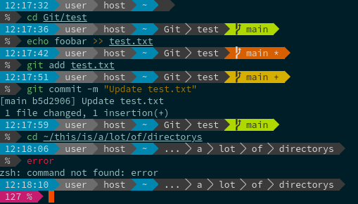

**[日本語のREADME](README-ja.md)も用意してあります。**  
# Prowpt - Simple, lightweight, and customizable Powerline-like prompt theme for Bash and Zsh  


## Screenshot  
  
Note: Syantax highlighting is not included.  
## Table Of Contents  
- [Prowpt - Simple, lightweight, and customizable Powerline-like prompt theme for Bash and Zsh](#prowpt---simple-lightweight-and-customizable-powerline-like-prompt-theme-for-bash-and-zsh)
  - [Screenshot](#screenshot)
  - [Table Of Contents](#table-of-contents)
  - [Features](#features)
  - [Requirements](#requirements)
  - [Appearance](#appearance)
    - [Git Status Icon](#git-status-icon)
  - [Installation](#installation)
    - [Bash](#bash)
      - [Manual](#manual)
      - [Sheldon](#sheldon)
    - [Zsh](#zsh)
      - [Manual](#manual-1)
      - [Oh-My Zsh](#oh-my-zsh)
      - [Zinit](#zinit)
      - [Antigen](#antigen)
      - [Zplug](#zplug)
      - [Sheldon](#sheldon-1)
  - [Customization](#customization)
    - [Customizable Value](#customizable-value)
      - [Text Values](#text-values)
      - [Delimiter](#delimiter)
      - [Whether To Highlight Home Dir (~)](#whether-to-highlight-home-dir-)
      - [Prompt Color](#prompt-color)
      - [Git Segment Style](#git-segment-style)
    - [Other Customization](#other-customization)
  - [Contributing](#contributing)
  - [Contact Me](#contact-me)
  - [License](#license)


## Features  
- Easy to manage plugin with common plugin managers like Zinit, or Oh-My-Zsh, e.t.c.  
- The display and colors change depending on the Git branch state.  
- Python virtualenv environments are displayed.
- Easy to custom due to simpler code  
- Many customizable variables  
- Lightweight repository  

## Requirements  
- Bash or Zsh shell  
It does not work on Fish Shell.  
- Git command  
- [Nerd Fonts](https://www.nerdfonts.com)  
It needs Nerd Fonts to use glyphs.  
- Terminal emulator that can display 256 colors.  

## Appearance  
  
Python virtualenv environment name will be displayed when you are in the environment.  
### Git Status Icon 
If there is/are
- unstaged file(s): ```*```  
- staged file(s): ```+```  
- something stashed: ```$```  
- untracked file(s): ```%```  

HEAD and upstream defference  
- behind: ```<```  
- ahead: ```>```  
- diverged: ```<>```  
- up-to-date: ```=```  

## Installation  
### Bash  
#### Manual  
1. Clone the repository
    ```bash
    git clone https://github.com/alpaca-honke/prowpt.git ~/.prowpt/
    ```
1. Add the following line below the ```PS1``` settings in ```~/.bashrc```  
    ```bash:.bashrc
    source ~/.prowpt/prowpt.bash
    ```
1. Restart your terminal  

#### Sheldon  
1. Run the following command  
    ```bash
    sheldon add prowpt --github alpaca-honke/prowpt --use '*.bash' --branch main
    ```
1. Restart your terminal  

### Zsh  
#### Manual  
1. Clone the repository
    ```zsh
    git clone https://github.com/alpaca-honke/prowpt.git ~/.prowpt/
    ```
1. Comment out the following line in ```~/.zshrc```  
    ```zsh:.zshrc
    autoload -Uz promptinit
    promptinit
    prompt adam1
    ```
1. Add the following line in ```~/.zshrc```  
    ```zsh:.zshrc
    source ~/.prowpt/prowpt.plugin.zsh
    ```
1. Restart your terminal  

#### Oh-My Zsh  
1. Clone the repository
    ```zsh
    git clone https://github.com/alpaca-honke/prowpt.git ${ZSH_CUSTOM:-~/.oh-my-zsh/custom}/plugins/prowpt/
    ```
1. Add ```prowpt``` to the list of plugins for Oh-My-Zsh in the ```~/.zshrc```  
    ```zsh:.zshrc
    plugins=(
        #other plugins
        prowpt
    )
    ```
1. Restart your terminal  

#### Zinit  
1. Add the following line to ```~/.zshrc```  
    ```zsh
    zinit light alpaca-honke/prowpt
    ```
1. Restart your terminal  

#### Antigen  
1. Run the following command  
   ```zsh
   antigen bundle alpaca-honke/prowpt
   ```
2. Restart your terminal  

#### Zplug  
1. Add the following line to ```~/.zshrc```  
    ```zsh:.zshrc
    zplug "alpaca-honke/prowpt", as:plugin, at:main
    ```
1. Restart your terminal  

#### Sheldon  
1. Run the following command  
    ```zsh
    sheldon add prowpt --github alpaca-honke/prowpt --branch main
    ```
1. Restart your terminal  

## Customization  
You can easily to custom it using ```~/.config/prowpt/config.sh```.  
1. Create a directory  
    ```sh
    mkdir ~/.config/prowpt/
    ```
1. Edit config file (You can use other text editors.)  
    ```sh
    vim ~/.config/prowpt/config.sh
    ```

### Customizable Value   
You can easily to custom prompt by setting some variables like this:  
```sh:config.sh
PROWPT_SEGMENT_SEPARATOR=$'\ue0b8'
PROWPT_CURRENT_TIME_BG="5"
GIT_PS1_SHOWUPSTREAM=""
```

#### Text Values  
| Variables | Description | Default |  
| ---- | ---- | ---- |  
| PROWPT_CURRENT_TIME | First segment value | Bash: ```\t```, Zsh: ```%*``` |  
| PROWPT_USER | Second segment value | Bash: ```\u```, Zsh: ```%n``` |
| PROWPT_HOST | Third segment value | Bash: ```\h```, Zsh: ```%m``` |
| PROWPT_PROMPT | Last (second line) segment value | Bash: ```$```, Zsh: ```%#``` |
| PROWPT_GIT_HEAD_BRANCH | An icon that is shown when current HEAD is a branch in Git repos | ```$'\ue0a0'``` |  
| PROWPT_GIT_HEAD_DETACHED | An icon that is shown when current HEAD is a detached HEAD in Git repos | ```$\ue729'``` |  

#### Delimiter
Set the delimiter for segment (the block of the prompt).  
You can set the delimiter using unicode like ```$'\ue0b0'```.  
There is a list of commonly used delimiters.  
  
Note: You can use e0b1, e0b5, e0b9, e0bb, e0c1, e0cd for the PWD delimiter, and any other character in the list for segment delimiters.  
If you want to use vertical segment delimiters, set ```PROWPT_SEGMENT_DELIMITER=""```. The same as for PWD delimiters, you can use ```|``` (pipe).  

| Variables | Description | Default |  
| ---- | --- | ---- |  
| PROWPT_SEGMENT_DELIMITER | Segment delimiter | ```$'\ue060'``` |  
| PROWPT_PWD_DELIMITER | Current directory delimiter instead of ```/``` | ```$'\ue0b1'``` |  

#### Whether To Highlight Home Dir (~)   
If you want to highlight your home directory, set  
```PROWPT_PWD_HOME_HIGHLIGHT="yes"``` .  
If not,  
set ```PROWPT_PWD_HOME_HIGHLIGHT="no"``` or any other value.  

#### Prompt Color  
You can set prompt colors using ANSI 256 colors.  
[256 Colors Cheat Sheet](https://www.ditig.com/256-colors-cheat-sheet)  

| Variables | Description | Default |  
| ---- | ---- | ---- |  
| PROWPT_CURRENT_TIME_FG | First segment foreground color | ```253``` |  
| PROWPT_CURRENT_TIME_BG | First segment background color | ```31``` |  
| PROWPT_USER_FG | Second segment foreground color | ```253``` |
| PROWPT_USER_BG | Second segment background color | ```242``` |  
| PROWPT_HOST_FG | Third segment foreground color | ```253``` |  
| PROWPT_HOST_BG | Third segment background color | ```239``` |
| PROWPT_PWD_FG | PWD segment foreground color | ```253``` |  
| PROWPT_PWD_BG | PWD segment background color | ```237``` |  
| PROWPT_PWD_DELIMITER_FG | PWD delimiter foreground color | ```250``` |  
| PROWPT_PWD_HOME_FG | Home directory segment foreground color (when you set ```PROWPT_PWD_HOME_HIGHLIGHT="yes"```) | ```253``` |  
| PROWPT_PWD_HOME_BG | Home directory segment background color (when you set ```PROWPT_PWD_HOME_HIGHLIGHT="no"```) | ```31``` |  
| PROWPT_GIT_FG | Git status segment foreground color | ```236``` |  
| PROWPT_GIT_BG | Git status segment background color | ```148``` |  
| PROWPT_GIT_DIRTY_FG | Git status segment foreground color when working tree is dirty | ```253``` |  
| PROWPT_GIT_DIRTY_BG | Git status segment background color when working tree is dirty | ```166``` |  
| PROWPT_GIT_STAGED_FG | Git status segment foreground color when there are some staged files | ```236``` |  
| PROWPT_GIT_STAGED_BG | Git status segment background color when there are some staged files | ```178``` |  
| PROWPT_GIT_DETACHED_FG | Git status segment background color when current HEAD is a detached HEAD | ```253``` |  
| PROWPT_GIT_DETACHED_BG | Git status segment foreground color when current HEAD is a detached HEAD | ```103``` |  
| PROWPT_PROMPT_FG | Last (second line) segment foreground color | ```253``` |  
| PROWPT_PROMPT_BG | Last (second line) segment background color | ```237``` |  
| PROWPT_PROMPT_ERROR_FG | Last (second line) segment foreground color (when exit status is not 0) | ```253``` |  
| PROWPT_PROMPT_ERROR_BG | Last (second line) segment background color (when exit status is not 0) | ```5``` |  

#### Git Segment Style  
This segment uses [https://github.com/git/git/blob/master/contrib/completion/git-prompt.sh](https://github.com/git/git/blob/master/contrib/completion/git-prompt.sh).  
The customizable variables follow this script.  

| Variables | Description | Default |  
| ---- | ---- | ---- |  
| GIT_PS1_SHOWDIRTYSTATE | If you set it to a noempty value, unstaged (*) and staged (+) changes will be shown next to the branch name. | ```yes``` |  
| GIT_PS1_SHOWSTASHSTATE | By setting it to a nonempty value, if something is stashed, then a '$' will be shown next to the branch name. | ```yes``` |  
| GIT_PS1_SHOWUNTRACKEDFILES | If you set it to a nonempty value, then a '%' will be shown next to the branch name if there're untracked files. | ```yes``` |  
| GIT_PS1_SHOWUPSTREAM | If you set ```GIT_PS1_SHOWUPSTREAM="auto"```, then the difference betweeen HEAD and its upstream will be shown next to the branch name. A "<" indicates you are behind, ">" indicates you are ahead, "<>" indicates you have diverged and "=" indicates that there is no difference. | ```auto``` |  

See [https://github.com/git/git/blob/master/contrib/completion/git-prompt.sh](https://github.com/git/git/blob/master/contrib/completion/git-prompt.sh) or [prowpt/git-prompt.sh](git-prompt.sh) for details. Other customizable variables are also written there.  

### Other Customization  
If you want to custom but there are no customizable variables for it, overwrite ```prowpt-core.sh``` or any other files.   

## Contributing  
I know this program is not complete.We welcome your contribution to this program. If you are willing to contribute, please make some pull requests.  

- Fork this repository  
- Make changes to forked repo
- Make pull request(s) to alpaca-honke/prowpt develop branch

In the same way, open an issue if you find some problems or need more features.  

## Contact Me  
If there is/are some bugs or other problems,  
- Open an issue if it is about this program.  
- If you don't have a GitHub account, or have other reasons to think you shouldn't open an issue of it, contact me via Twitter DM: [Twitter @alpaca_honke](https://twitter.com/alpaca_honke) , or [Google Forms](https://docs.google.com/forms/d/e/1FAIpQLSdRuzAmGEqDV4RRd-70JKXD0lAHE6xjEp8Qp5-Jfut-ysQMYQ/viewform) (Though it is written in Japanese, don't translate your writing to Japanese.) with a note that it is about Prowpt.  

**Note: If you have some questions, use [Google Forms](https://docs.google.com/forms/d/e/1FAIpQLSdRuzAmGEqDV4RRd-70JKXD0lAHE6xjEp8Qp5-Jfut-ysQMYQ/viewform). Don't use the issues to ask some questions.**  

## License  
Prowpt is free software: you can redistribute it and/or modify it under the terms of the GNU General Public License as published by  the Free Software Foundation, version 2.0 of the License.

Prowpt is distributed in the hope that it will be useful, but WITHOUT ANY WARRANTY; without even the implied warranty of MERCHANTABILITY or FITNESS FOR A PARTICULAR PURPOSE.  

See [COPYING](COPYING) or [GNU General Public Licence version 2.0](https://www.gnu.org/licenses/old-licenses/gpl-2.0.html), and [Licenses - GNU Project - Free Software Foundation](https://www.gnu.org/licenses/) for more details.  

Copyright (C) 2023 あるかっぱ/アルパカ本家 Alkappa/alpaca-honke  
